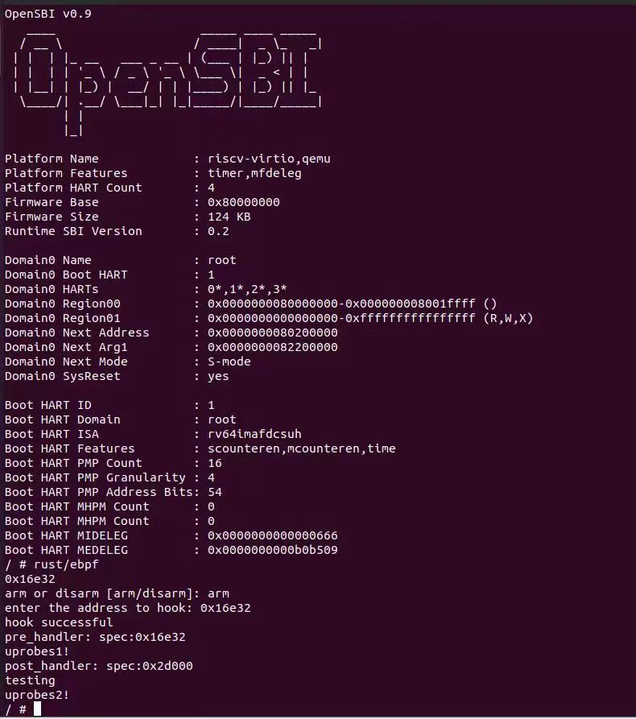
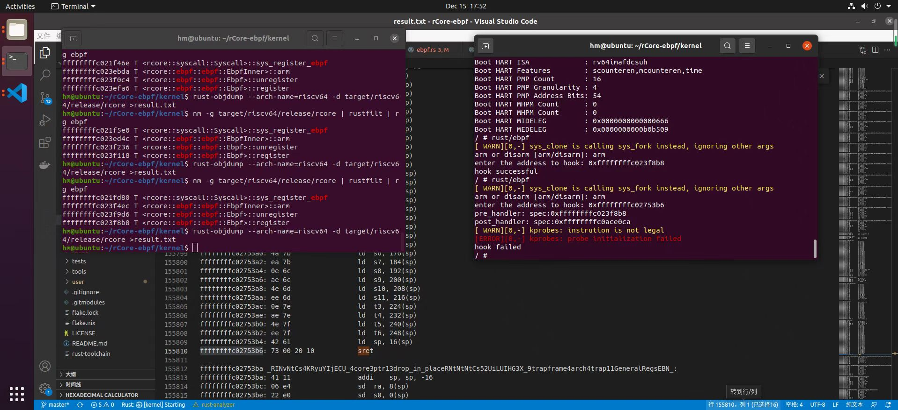

# Rust ebpf

项目技术报告：[Rust eBPF](http://hm1229.top/rust_ebpf_book/book/index.html)

## 项目总体规划

- [x] kprobes

  完成内核空间指令的动态插桩，对内核函数/合法指令进行跟踪

- [x] uprobes

  完成用户空间指令的动态插桩，对用户态程序中的函数/合法指令进行跟踪

- [ ] function parameter probing in probes

  完成probes对函数参数的获取

- [ ] async in probes

  完成probes对rust async 函数的跟踪支持

- [ ] ebpf

  根据ebpf原理实现一个简单的ebpf

## 项目进展

### 5-15

基本完成uprobes总体事项，考虑实现probe trait将代码整合

### 1-30

完成kprobes总体事项,可以对内核函数/合法指令进行动态跟踪

## 阶段性技术报告

### 5-15

#### 前期调研情况：

- 基础u/kprobes目前已基本完工
- 对函数参数传递过程中间跟踪的想法是：根据传递的寄存器存储的地址以及符号表或其他资源拿取数据类型
- 对Rust async函数的跟踪目前考虑通过抓取poll的进出来解决
- ebpf完全体十分庞大且复杂，目前期望做一个能实现简易功能的ebpf，目前ebpf的动态插桩功能由k/uprobes完成

#### 导师沟通情况：

- 与导师已经取得联系，并已获得校内和项目导师的指导

#### 下一步预期规划：

- 实现probe trait 将代码整合
- 尝试理解rust编译过程，找出数据存放地址与数据类型的映射关系
- 异步函数的跟踪
- ebpf

#### 困难/需要得到的帮助

- 如何拿到数据地址与数据类型的映射关系，并能够根据数据地址直接输出数据。

