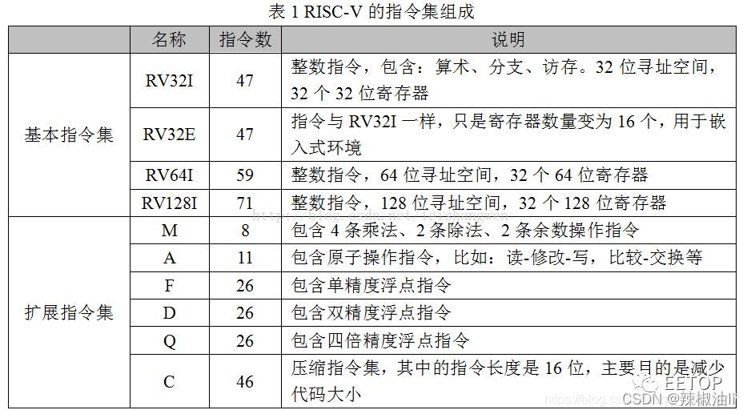
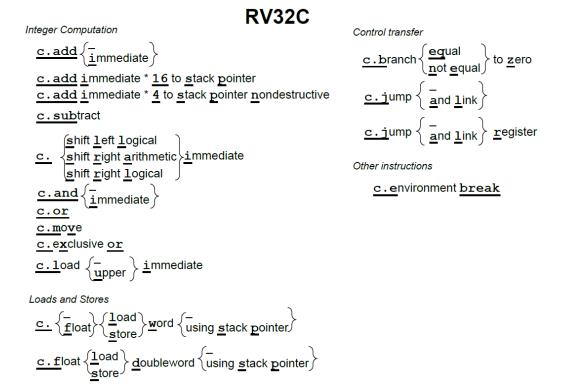
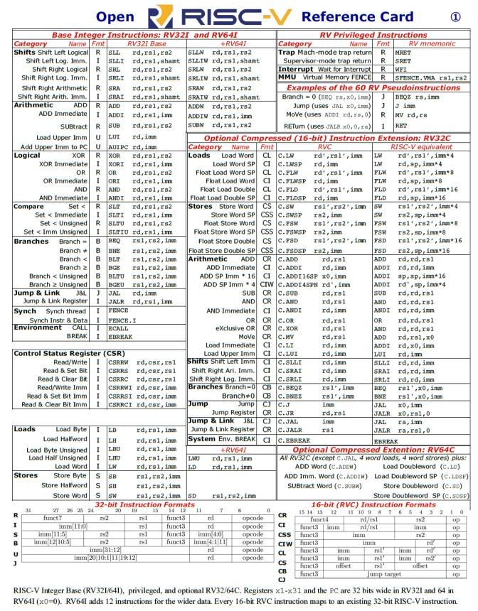
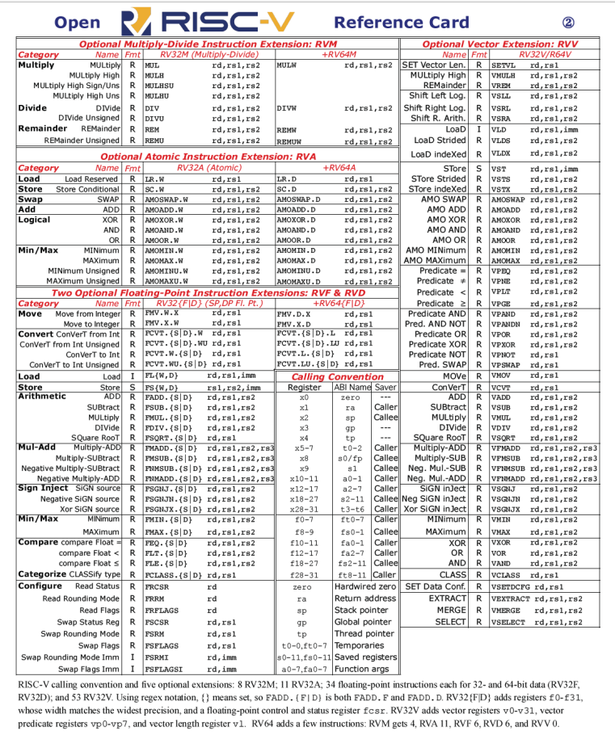
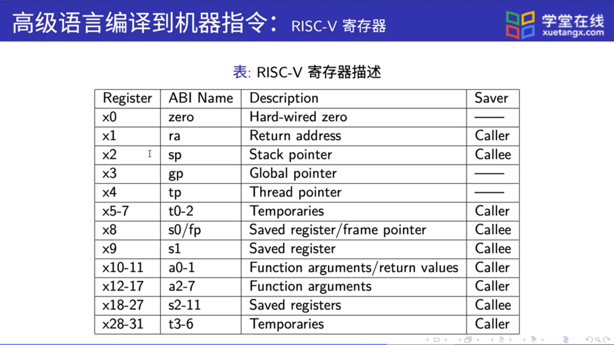

# Risc-V 

- [简介](#简介)
- [指令集](#指令集)
  - [指令集组成](#指令集组成)
  - [压缩指令](#压缩指令)
  - [详细指令参考卡片](#详细指令参考卡片)
  - [寄存器](#寄存器)

## 简介

**RISC-V**是一个基于精简指令集（RISC）原则的开源指令集架构（ISA）。

与大多数指令集相比，RISC-V指令集可以自由地用于任何目的，允许任何人设计、制造和销售RISC-V芯片和软件。虽然这不是第一个开源指令集，但它具有重要意义，因为其设计使其适用于现代计算设备（如仓库规模云计算机、高端移动电话和微小嵌入式系统）。设计者考虑到了这些用途中的性能与功率效率。该指令集还具有众多支持的软件，这解决了新指令集通常的弱点。

## 指令集

### 指令集组成

RISC-V采用模块化的指令集，易于扩展、组装。

RISCV ISA = 1 个基本整数指令集（I） + 多个可选的扩展指令集

其中唯一强制要求实现的基础指令集，其他指令集都是可选的扩展模块。RISC-V 允许在实现中以可选的形式实现其他标准化和非标准化的指令集扩展。
RISC-V指令集模块包括：

#### 压缩指令

RV32C 采用了一种新颖的方法：每条短指令必须和一条标准的 32 位 RISC-V 指令一一 对应。此外，16 位指令只对汇编器和链接器可见，并且是否以短指令取代对应的宽指令由 它们决定。编译器编写者和汇编语言程序员可以幸福地忽略 RV32C 指令及其格式，他们能 感知到的则是最后的程序大小小于大多数其它 ISA 的程序。图是 RV32C 扩展指令集的 图形化表示。

 为了能在一系列的程序上得到良好的代码压缩效果，RISC-V 架构师精心挑选了 RVC 扩展中的指令。同时，基于以下的三点观察，架构师们成功地将指令压缩到了 16 位。第 一，对十个常用寄存器（a0-a5，s0-s1，sp 以及 ra）访问的频率远超过其他寄存器；第 二，许多指令的写入目标是它的源操作数之一；第三，立即数往往很小，而且有些指令比 较喜欢某些特定的立即数。因此，许多 RV32C 指令只能访问那些常用寄存器；一些指令隐 式写入源操作数的位置；几乎所有的立即数都被缩短了，load 和 store 操作只使用操作数整 数倍尺寸的无符号数偏移量。

### 详细指令参考卡片

### 寄存器

RISC-V 有足够多的寄存器来达到两全其美的结果：既能将操作数存放在寄存器中，同 时也能减少保存和恢复寄存器的次数。其中的关键在于，在函数调用的过程中不保留部分寄 存器存储的值，称它们为临时寄存器；另一些寄存器则对应地称为保存寄存器。不再调用其 它函数的函数称为叶函数。当一个叶函数只有少量的参数和局部变量时，它们可以都被存储 在寄存器中，而不会“溢出（spilling）”到内存中。但如果函数参数和局部变量很多，程序 还是需要把寄存器的值保存在内存中，不过这种情况并不多见。

