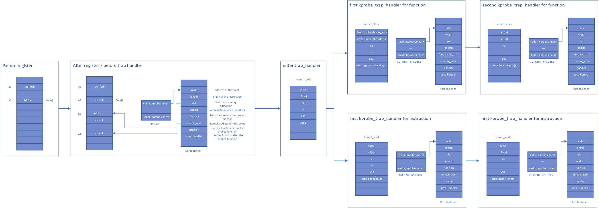
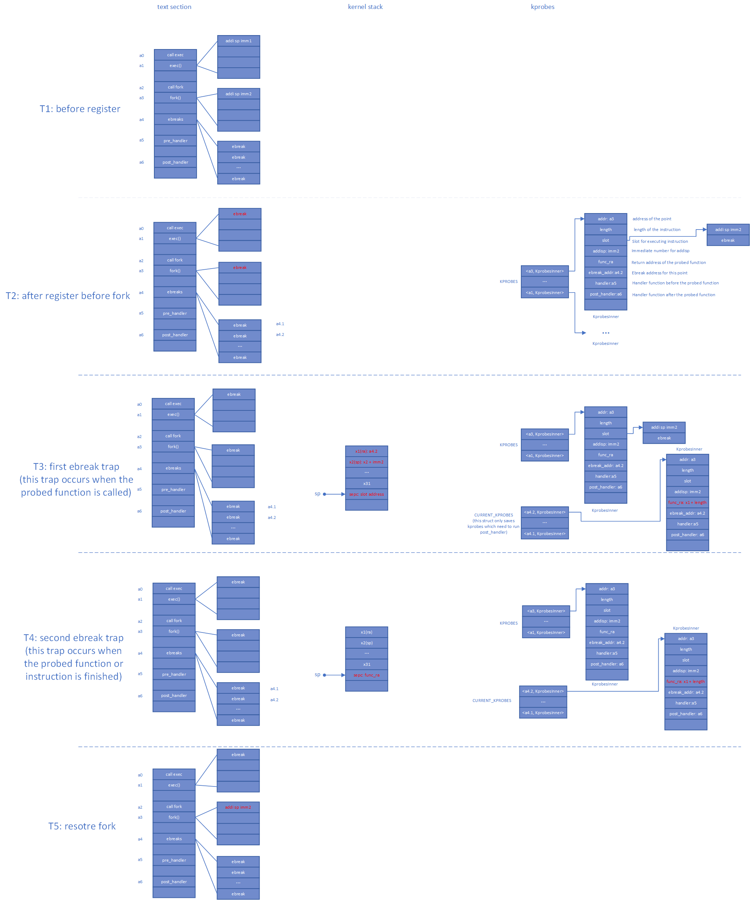

# kprobes

- [设计思路](#设计思路)
  - [函数跟踪](#设计思路)
  - [指令跟踪](#指令跟踪)
  - [数据结构](#数据结构)
- [流程图](#流程图)
  - [流程图数据结构版](#流程图数据结构版)
  - [流程图堆栈版](#流程图堆栈版)

## 设计思路

### 函数跟踪

1. 注册阶段

   - 根据传入的地址，解析指令，获取sp的变化值，与`handler`，`post_handler`等一起存入`kprobes`数据结构中.
   - 将当前地址的指令改为`ebreak`.

2. 中断处理阶段

   根据中断地址判断当前属于哪个`kprobe`,并判断其属于哪一次中断.

   - 第一次中断
     1. 执行`handler`.
     2. 保存跟踪函数的返回值，并将其改为ebreak的地址.
     3. 根据解析出的sp值，对堆栈指针进行操作.
     4. 返回到中断指令的下一条指令.
   - 第二次中断
     1. 执行`post_handler`.
     2. 将中断的返回地址改为之前保存的返回值.

### 指令跟踪

1. 注册阶段

   - 根据传入的地址，解析指令，判断是否合法(合法的判断条件同Linux的规则)，将`handler`，`post_handler`等一起存入`kprobes`数据结构中.
   - 如果合法，将当前地址的指令存放到一片已经开辟了的内存空间中，并在指令后添加ebreak指令.

2. 中断处理阶段

   根据中断地址判断当前属于哪个`kprobe`,并判断其属于哪一次中断.

   - 第一次中断
     1. 执行`handler`.
     2. 返回到注册阶段开辟出来的地址上.
   - 第二次中断
     1. 执行`post_handler`.
     2. 将中断返回地址改为原地址的下一条指令的地址.

### 数据结构

- **addr：** 跟踪的地址
- **length：** 指令长度
- **slot：** 指令插槽值
- **addisp：** 栈指针偏移
- **func_ra：** 返回值地址
- **func_ebreak_addr：** 函数中断地址
- **insn_ebreak_addr：** 指令中断地址
- **handler：** 跟踪前回调函数
- **post_handler：** 跟踪后回调函数
- **probe_type：** 探测类型

## 流程图

### 流程图数据结构版

### 流程图堆栈版

