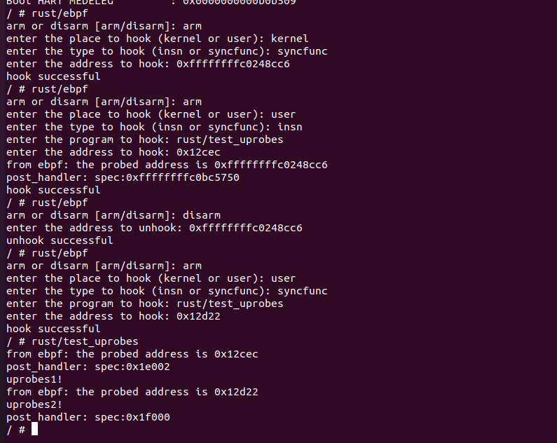

# 动态注册eBPF程序测试

## 测试准备

### eBPF demo

实现了一个小的eBPF程序，只负责打印输出寄存器中的`sepc`值

```c
int prog(struct TrapFrame* cx) {
    char fmt[] = "from ebpf: the probed address is {}";
    bpf_trace_printk(fmt, 37, cx->sepc, 0, 0);
    return 0;
}
```

### 用户态程序

#### eBPF插桩程序

该程序主要负责接收用户的动态注册要求，通过系统调用的方式在内核态进行注册，注册完成会返回注册提示。

交互部分代码省略，系统调用注册部分代码：

```rust
//rust/ebpf
fn syscall_ebpf(addr: String, tp: u16, path: String){
    let prog = include_bytes!("hello.bin");
    if sys_register_ebpf(
        usize::from_str_radix(&addr, 16).unwrap(),
        prog as *const u8,
        prog.len(),
        tp as usize,
        path.as_ptr()
    ) == 0
    {
        println!("hook successful");
    } else {
        println!("hook failed");
    }
}
```

#### 用户态动态插桩测试程序

该程序只用来调用两个函数：

```rust
//rust/test_uprobes
pub fn main(){
    test_uprobes1();
    test_uprobes2();
}

#[inline(never)]
fn test_uprobes1(){
    println!("uprobes1!");
}

#[inline(never)]
fn test_uprobes2(){
    println!("uprobes2!");
}
```

## 测试

### 测试步骤

1. 进行内核eBPF注册程序(`ebpf::arm`)的函数跟踪插桩
2. 进行用户态测试程序(`test_uprobes::test_uprobes1`)的指令跟踪插桩
3. 解除内核eBPF注册程序(`ebpf::arm`)的插桩
4. 进行用户态测试程序(`test_uprobes::test_uprobes2`)的函数跟踪插桩
5. 运行用户态测试程序(`test_uprobes`)

### 结果展示



### 结果解析

1. 在进行用户态测试程序(`test_uprobes::test_uprobes1`)的指令跟踪插桩后，会有输出:

   ```
   from ebpf: the probed address is 0xffffffffc0248cc6
   post_handler: spec:0xffffffffc0bc5750
   ```

   说明内核态程序可以正常动态跟踪，eBPF程序可以正常运行。

2. 在第二次进行用户态测试程序(`test_uprobes::test_uprobes2`)的指令跟踪插桩后，没有输出，说明跟踪可以正常解除

3. 在最后运行`test_uprobes`时，`uprobes1!`的输出在`post_handler`前，`uprobes2!`的输出在`from ebpf...`与`post_handler`中间，说明用户态程序可以正常跟踪且指令和函数的跟踪均可以正常运行。